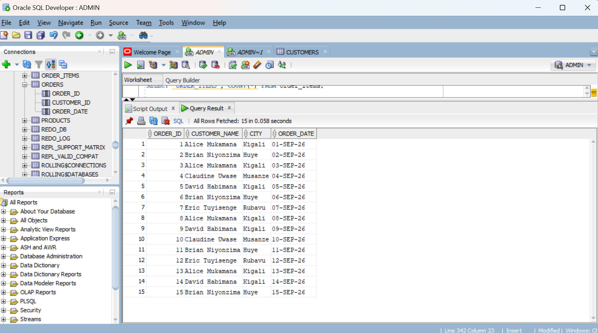
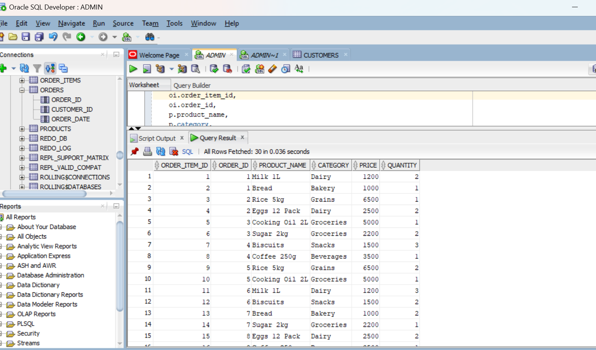
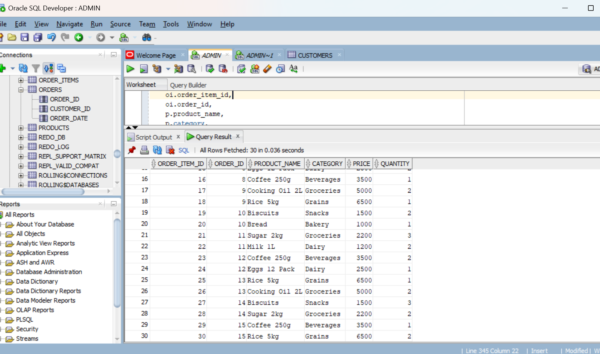
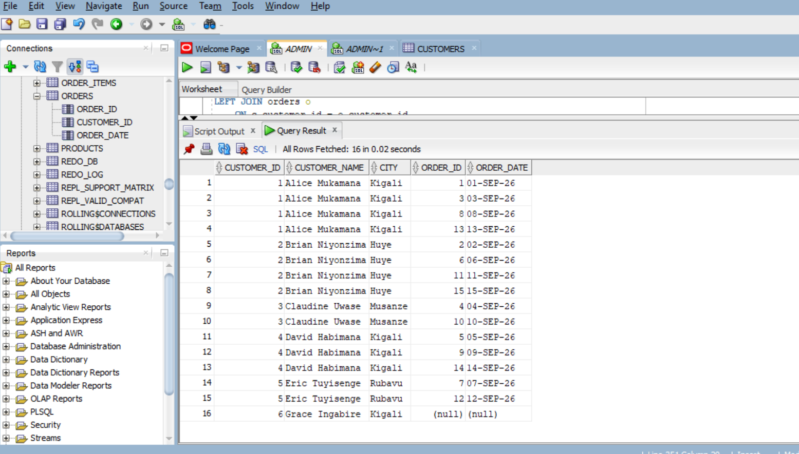
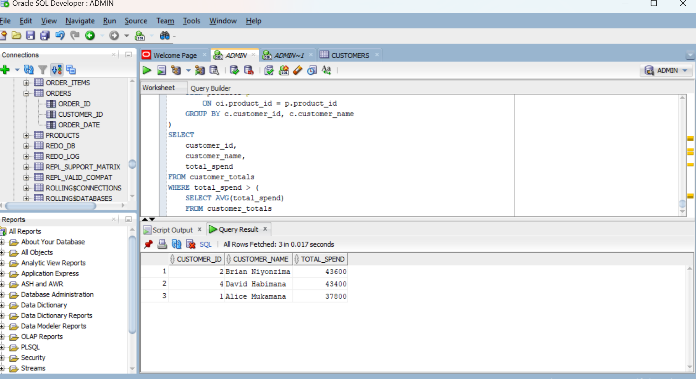
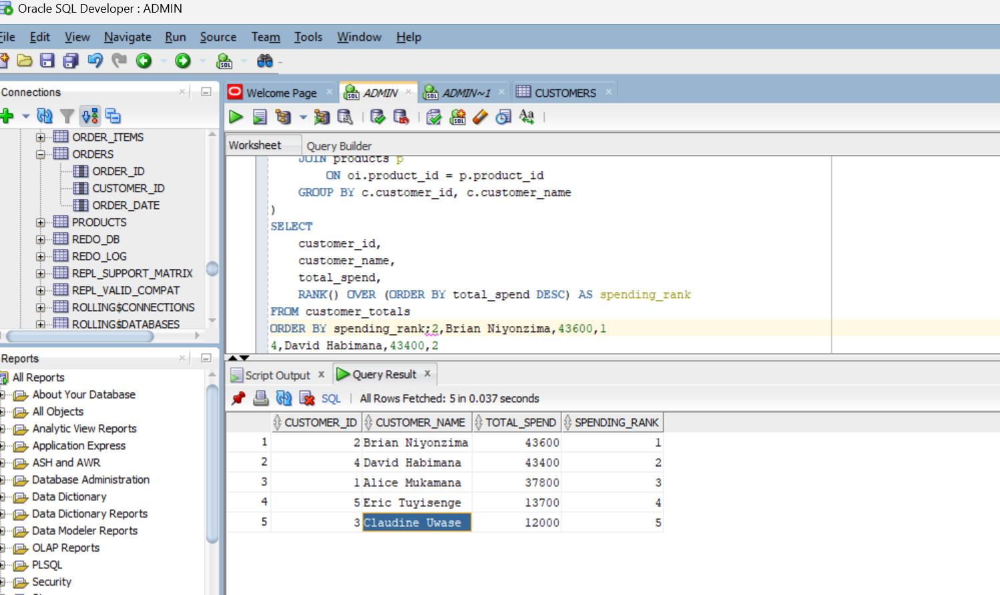
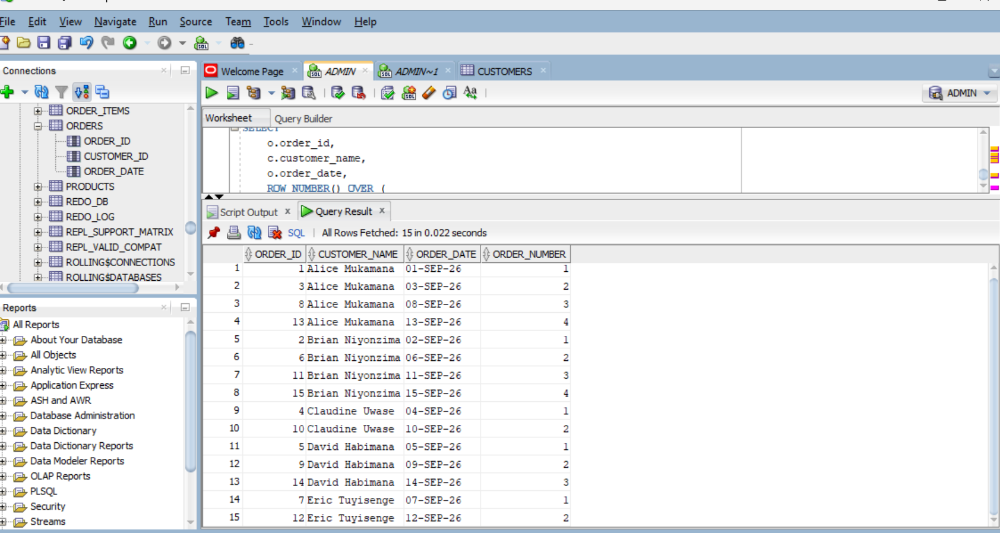
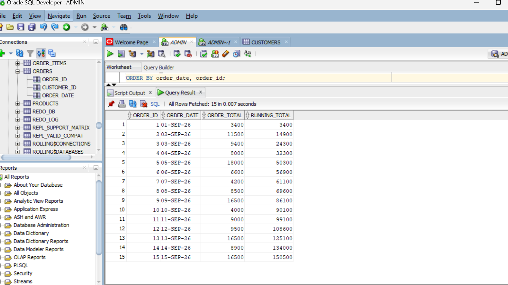
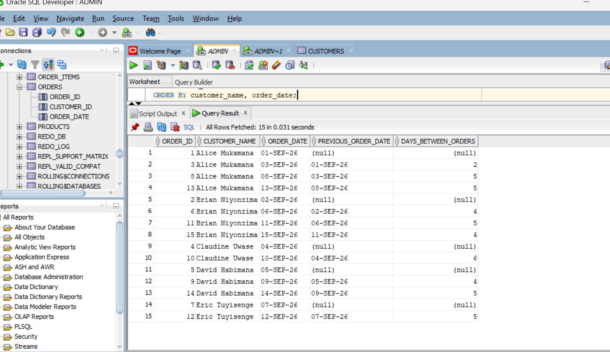

# PLSQL Assignment One — Sunrise Supermarket

## Student Information

| Field | Details |
|---|---|
| Name :| Mouminat Kampire UWABABYEYI |
| Student ID | 28538 |
| Group | C |
| Course |  Database Development with PL/SQL (INSY 8311) |
| DBMS Used | Oracle Database |
| Tool Used | Oracle SQL Developer |

## Business Scenario

Sunrise Supermarket sells different products to customers. Customers can place
orders, and each order can contain one or more products.

The management of Sunrise Supermarket wants to understand:
- Who their customers are
- What products customers buy
- How much customers spend
- How sales change over time
- How frequently customers place orders

To support this analysis, the database contains four main tables:
`customers`, `products`, `orders`, and `order_items`.

The database was populated with:
- 6 customers
- 8 products
- Products from multiple categories
- 15 orders
- 30 order items
- Orders occurring across multiple dates

## Short Summary

This assignment analyzes Sunrise Supermarket data using Oracle Database. I used JOINs, a CTE, and window functions to understand customer orders, product purchases, customer spending, and sales over time.

## Database Structure

The Sunrise Supermarket database consists of four related tables:

| Table | Description |
|---|---|
| `customers` | Stores customer information such as name, email, and city. |
| `products` | Stores product information such as product name, category, and price. |
| `orders` | Stores customer orders and the date each order was placed. |
| `order_items` | Stores the products and quantities included in each order. |

### Relationships

- Each customer can place multiple orders.
- Each order belongs to one customer.
- Each order can contain multiple order items.
- Each order item refers to one product.
- Products can appear in multiple order items.

## Query 1 — List Every Order with Customer Information

### SQL Query

```sql
SELECT
    o.order_id,
    c.customer_name,
    c.city,
    o.order_date
FROM orders o
INNER JOIN customers c
    ON o.customer_id = c.customer_id
ORDER BY o.order_date;
```

### Explanation

This query uses an `INNER JOIN` to combine the `orders` table with the `customers` table using `customer_id`.

It displays:

* The order ID
* The customer's name
* The customer's city
* The order date

Because an `INNER JOIN` is used, only orders that have a matching customer are included.

### Result

The query returned all 15 orders in chronological order.

| Order ID | Customer        | City    | Order Date |
| -------: | --------------- | ------- | ---------- |
|        1 | Alice Mukamana  | Kigali  | 01-SEP-26  |
|        2 | Brian Niyonzima | Huye    | 02-SEP-26  |
|        3 | Alice Mukamana  | Kigali  | 03-SEP-26  |
|        4 | Claudine Uwase  | Musanze | 04-SEP-26  |
|        5 | David Habimana  | Kigali  | 05-SEP-26  |
|        6 | Brian Niyonzima | Huye    | 06-SEP-26  |
|        7 | Eric Tuyisenge  | Rubavu  | 07-SEP-26  |
|        8 | Alice Mukamana  | Kigali  | 08-SEP-26  |
|        9 | David Habimana  | Kigali  | 09-SEP-26  |
|       10 | Claudine Uwase  | Musanze | 10-SEP-26  |
|       11 | Brian Niyonzima | Huye    | 11-SEP-26  |
|       12 | Eric Tuyisenge  | Rubavu  | 12-SEP-26  |
|       13 | Alice Mukamana  | Kigali  | 13-SEP-26  |
|       14 | David Habimana  | Kigali  | 14-SEP-26  |
|       15 | Brian Niyonzima | Huye    | 15-SEP-26  |

### Business Interpretation

This query allows Sunrise Supermarket management to see which customer placed each order, where the customer is located, and when the order was placed. This can help management analyze customer ordering activity.

### Screenshot




## Query 2 — List Every Order Item with Product Information

### SQL Query

```sql
SELECT
    oi.order_item_id,
    oi.order_id,
    p.product_name,
    p.category,
    p.price,
    oi.quantity
FROM order_items oi
INNER JOIN products p
    ON oi.product_id = p.product_id
ORDER BY oi.order_item_id;
```

### Explanation

This query uses an `INNER JOIN` to combine the `order_items` table with the `products` table using `product_id`.

It displays:

* The order item ID
* The order ID
* The product name
* The product category
* The product price
* The quantity purchased

This allows Sunrise Supermarket management to see which products were included in each order and the quantity purchased.

### Result

The query returned 30 order items.

| Order Item ID | Order ID | Product        | Category  | Price | Quantity |
| ------------: | -------: | -------------- | --------- | ----: | -------: |
|             1 |        1 | Milk 1L        | Dairy     |  1200 |        2 |
|             2 |        1 | Bread          | Bakery    |  1000 |        1 |
|             3 |        2 | Rice 5kg       | Grains    |  6500 |        1 |
|             4 |        2 | Eggs 12 Pack   | Dairy     |  2500 |        2 |
|             5 |        3 | Cooking Oil 2L | Groceries |  5000 |        1 |
|             6 |        3 | Sugar 2kg      | Groceries |  2200 |        2 |
|             7 |        4 | Biscuits       | Snacks    |  1500 |        3 |
|             8 |        4 | Coffee 250g    | Beverages |  3500 |        1 |
|             9 |        5 | Rice 5kg       | Grains    |  6500 |        2 |
|            10 |        5 | Cooking Oil 2L | Groceries |  5000 |        1 |
|            11 |        6 | Milk 1L        | Dairy     |  1200 |        3 |
|            12 |        6 | Biscuits       | Snacks    |  1500 |        2 |
|            13 |        7 | Bread          | Bakery    |  1000 |        2 |
|            14 |        7 | Sugar 2kg      | Groceries |  2200 |        1 |
|            15 |        8 | Eggs 12 Pack   | Dairy     |  2500 |        2 |
|            16 |        8 | Coffee 250g    | Beverages |  3500 |        1 |
|            17 |        9 | Cooking Oil 2L | Groceries |  5000 |        2 |
|            18 |        9 | Rice 5kg       | Grains    |  6500 |        1 |
|            19 |       10 | Biscuits       | Snacks    |  1500 |        2 |
|            20 |       10 | Bread          | Bakery    |  1000 |        1 |
|            21 |       11 | Sugar 2kg      | Groceries |  2200 |        3 |
|            22 |       11 | Milk 1L        | Dairy     |  1200 |        2 |
|            23 |       12 | Coffee 250g    | Beverages |  3500 |        2 |
|            24 |       12 | Eggs 12 Pack   | Dairy     |  2500 |        1 |
|            25 |       13 | Rice 5kg       | Grains    |  6500 |        1 |
|            26 |       13 | Cooking Oil 2L | Groceries |  5000 |        2 |
|            27 |       14 | Biscuits       | Snacks    |  1500 |        3 |
|            28 |       14 | Sugar 2kg      | Groceries |  2200 |        2 |
|            29 |       15 | Coffee 250g    | Beverages |  3500 |        1 |
|            30 |       15 | Rice 5kg       | Grains    |  6500 |        2 |

### Business Interpretation

This query helps management understand the products purchased in each order. It can support inventory management, product demand analysis, and understanding which product categories are included in customer purchases.

### Screenshot






## Query 3 — List All Customers and Their Orders

### SQL Query

```sql
SELECT
    c.customer_id,
    c.customer_name,
    c.city,
    o.order_id,
    o.order_date
FROM customers c
LEFT JOIN orders o
    ON c.customer_id = o.customer_id
ORDER BY c.customer_id, o.order_date;
```

### Explanation

This query uses a `LEFT JOIN` to combine the `customers` table with the
`orders` table using `customer_id`.

A `LEFT JOIN` returns all customers, including customers who have not placed
any orders. If a customer has no order, the order information appears as
`NULL`.

This is important because it allows Sunrise Supermarket management to
identify both active customers and customers who have not yet placed an
order.

### Result

The query returned all 6 customers and their orders. Grace Ingabire is
included even though she has no orders.

| Customer ID | Customer | City | Order ID | Order Date |
|---:|---|---|---:|---|
| 1 | Alice Mukamana | Kigali | 1 | 01-SEP-26 |
| 1 | Alice Mukamana | Kigali | 3 | 03-SEP-26 |
| 1 | Alice Mukamana | Kigali | 8 | 08-SEP-26 |
| 1 | Alice Mukamana | Kigali | 13 | 13-SEP-26 |
| 2 | Brian Niyonzima | Huye | 2 | 02-SEP-26 |
| 2 | Brian Niyonzima | Huye | 6 | 06-SEP-26 |
| 2 | Brian Niyonzima | Huye | 11 | 11-SEP-26 |
| 2 | Brian Niyonzima | Huye | 15 | 15-SEP-26 |
| 3 | Claudine Uwase | Musanze | 4 | 04-SEP-26 |
| 3 | Claudine Uwase | Musanze | 10 | 10-SEP-26 |
| 4 | David Habimana | Kigali | 5 | 05-SEP-26 |
| 4 | David Habimana | Kigali | 9 | 09-SEP-26 |
| 4 | David Habimana | Kigali | 14 | 14-SEP-26 |
| 5 | Eric Tuyisenge | Rubavu | 7 | 07-SEP-26 |
| 5 | Eric Tuyisenge | Rubavu | 12 | 12-SEP-26 |
| 6 | Grace Ingabire | Kigali | NULL | NULL |

### Business Interpretation

This query helps management identify customers who have placed orders and
customers who have not placed any orders. The information can support
customer engagement and follow-up activities.

### Screenshot



## Query 4 — Customers Above Average Spending

### SQL Query

```sql
WITH customer_totals AS (
    SELECT
        c.customer_id,
        c.customer_name,
        SUM(oi.quantity * p.price) AS total_spend
    FROM customers c
    JOIN orders o
        ON c.customer_id = o.customer_id
    JOIN order_items oi
        ON o.order_id = oi.order_id
    JOIN products p
        ON oi.product_id = p.product_id
    GROUP BY c.customer_id, c.customer_name
)
SELECT
    customer_id,
    customer_name,
    total_spend
FROM customer_totals
WHERE total_spend > (
    SELECT AVG(total_spend)
    FROM customer_totals
)
ORDER BY total_spend DESC;
```

### Explanation

This query uses a Common Table Expression (CTE) named `customer_totals` to calculate the total amount spent by each customer.

The total spending is calculated by multiplying the quantity of each product purchased by its price and then adding these amounts for each customer.

The main query then calculates the average spending among customers who placed orders and returns only customers whose total spending is greater than this average.

### Result

The query returned three customers whose total spending was above the average.

| Customer ID | Customer        | Total Spend |
| ----------: | --------------- | ----------: |
|           2 | Brian Niyonzima |      43,600 |
|           4 | David Habimana  |      43,400 |
|           1 | Alice Mukamana  |      37,800 |

### Business Interpretation

This query helps Sunrise Supermarket identify customers who spend more than the average amount. Management can use this information to understand high-spending customers and analyze their purchasing behavior for customer retention and loyalty activities.

### Screenshot



## Query 5 — Rank Customers by Total Amount Spent

### SQL Query

```sql
WITH customer_totals AS (
    SELECT
        c.customer_id,
        c.customer_name,
        SUM(oi.quantity * p.price) AS total_spend
    FROM customers c
    JOIN orders o
        ON c.customer_id = o.customer_id
    JOIN order_items oi
        ON o.order_id = oi.order_id
    JOIN products p
        ON oi.product_id = p.product_id
    GROUP BY c.customer_id, c.customer_name
)
SELECT
    customer_id,
    customer_name,
    total_spend,
    RANK() OVER (ORDER BY total_spend DESC) AS spending_rank
FROM customer_totals
ORDER BY spending_rank;
```

### Explanation

This query uses a Common Table Expression (CTE) to calculate the total amount spent by each customer.

The `RANK()` window function then ranks customers according to their total spending, with the customer who spent the highest amount receiving rank 1.

The ranking is performed in descending order of total spending.

### Result

The query ranked the customers according to their total spending.

| Customer ID | Customer        | Total Spend | Spending Rank |
| ----------: | --------------- | ----------: | ------------: |
|           2 | Brian Niyonzima |      43,600 |             1 |
|           4 | David Habimana  |      43,400 |             2 |
|           1 | Alice Mukamana  |      37,800 |             3 |
|           5 | Eric Tuyisenge  |      13,700 |             4 |
|           3 | Claudine Uwase  |      12,000 |             5 |

Grace Ingabire is not included because she has not placed any orders and therefore has no spending total.

### Business Interpretation

This query helps Sunrise Supermarket understand the relative spending levels of customers. Management can use the ranking to identify customers with higher spending and analyze customer purchasing patterns.

### Screenshot



## Query 6 — Number Each Customer's Orders in Order Placed

### SQL Query

```sql
SELECT
    o.order_id,
    c.customer_name,
    o.order_date,
    ROW_NUMBER() OVER (
        PARTITION BY o.customer_id
        ORDER BY o.order_date
    ) AS order_number
FROM orders o
JOIN customers c
    ON o.customer_id = c.customer_id
ORDER BY c.customer_name, o.order_date;
```

### Explanation

This query uses the `ROW_NUMBER()` window function to number each customer's orders in the order they were placed.

The `PARTITION BY o.customer_id` separates the orders for each customer, while `ORDER BY o.order_date` arranges each customer's orders from the earliest to the latest.

As a result, the first order of each customer is assigned number 1, the second order is assigned number 2, and so on.

### Result

The query numbered each customer's orders according to the date they were placed.

| Order ID | Customer        | Order Date | Order Number |
| -------: | --------------- | ---------- | -----------: |
|        1 | Alice Mukamana  | 01-SEP-26  |            1 |
|        3 | Alice Mukamana  | 03-SEP-26  |            2 |
|        8 | Alice Mukamana  | 08-SEP-26  |            3 |
|       13 | Alice Mukamana  | 13-SEP-26  |            4 |
|        2 | Brian Niyonzima | 02-SEP-26  |            1 |
|        6 | Brian Niyonzima | 06-SEP-26  |            2 |
|       11 | Brian Niyonzima | 11-SEP-26  |            3 |
|       15 | Brian Niyonzima | 15-SEP-26  |            4 |
|        4 | Claudine Uwase  | 04-SEP-26  |            1 |
|       10 | Claudine Uwase  | 10-SEP-26  |            2 |
|        5 | David Habimana  | 05-SEP-26  |            1 |
|        9 | David Habimana  | 09-SEP-26  |            2 |
|       14 | David Habimana  | 14-SEP-26  |            3 |
|        7 | Eric Tuyisenge  | 07-SEP-26  |            1 |
|       12 | Eric Tuyisenge  | 12-SEP-26  |            2 |

### Business Interpretation

This query helps Sunrise Supermarket track the sequence of orders placed by each customer. Management can use this information to understand customer purchasing frequency and identify repeat customers.

### Screenshot



## Query 7 — Running Total of Revenue Over Time

### SQL Query

```sql id="zrlj5v"
WITH order_revenue AS (
    SELECT
        o.order_id,
        o.order_date,
        SUM(oi.quantity * p.price) AS order_total
    FROM orders o
    JOIN order_items oi
        ON o.order_id = oi.order_id
    JOIN products p
        ON oi.product_id = p.product_id
    GROUP BY o.order_id, o.order_date
)
SELECT
    order_id,
    order_date,
    order_total,
    SUM(order_total) OVER (
        ORDER BY order_date, order_id
        ROWS BETWEEN UNBOUNDED PRECEDING AND CURRENT ROW
    ) AS running_total
FROM order_revenue
ORDER BY order_date, order_id;
```

### Explanation

This query uses a Common Table Expression (CTE) named `order_revenue` to calculate the total revenue generated by each order.

The `SUM()` window function is then used to calculate a running total of revenue over time.

The orders are arranged by `order_date` and `order_id`, so each row shows the revenue from that order and the accumulated revenue from all orders up to that date.

### Result

The query produced the following running revenue totals:

| Order ID | Order Date | Order Total | Running Total |
| -------: | ---------- | ----------: | ------------: |
|        1 | 01-SEP-26  |       3,400 |         3,400 |
|        2 | 02-SEP-26  |      11,500 |        14,900 |
|        3 | 03-SEP-26  |       9,400 |        24,300 |
|        4 | 04-SEP-26  |       8,000 |        32,300 |
|        5 | 05-SEP-26  |      18,000 |        50,300 |
|        6 | 06-SEP-26  |       6,600 |        56,900 |
|        7 | 07-SEP-26  |       4,200 |        61,100 |
|        8 | 08-SEP-26  |       8,500 |        69,600 |
|        9 | 09-SEP-26  |      16,500 |        86,100 |
|       10 | 10-SEP-26  |       4,000 |        90,100 |
|       11 | 11-SEP-26  |       9,000 |        99,100 |
|       12 | 12-SEP-26  |       9,500 |       108,600 |
|       13 | 13-SEP-26  |      16,500 |       125,100 |
|       14 | 14-SEP-26  |       8,900 |       134,000 |
|       15 | 15-SEP-26  |      16,500 |       150,500 |

### Business Interpretation

This query helps Sunrise Supermarket monitor how total revenue accumulates over time. Management can use the running total to track sales growth during the period and understand how individual orders contribute to overall revenue.

The final running total is 150,500, representing the total revenue from all 15 orders in the dataset.

### Screenshot



## Query 8 — Days Between Current and Previous Order

### SQL Query

```sql id="qvzknl"
WITH customer_orders AS (
    SELECT
        o.order_id,
        o.customer_id,
        c.customer_name,
        o.order_date,
        LAG(o.order_date) OVER (
            PARTITION BY o.customer_id
            ORDER BY o.order_date
        ) AS previous_order_date,
        COUNT(*) OVER (
            PARTITION BY o.customer_id
        ) AS order_count
    FROM orders o
    JOIN customers c
        ON o.customer_id = c.customer_id
)
SELECT
    order_id,
    customer_name,
    order_date,
    previous_order_date,
    order_date - previous_order_date AS days_between_orders
FROM customer_orders
WHERE order_count > 1
ORDER BY customer_name, order_date;
```

### Explanation

This query uses the `LAG()` window function to find the previous order date for each customer.

The `PARTITION BY o.customer_id` separates the orders by customer, while `ORDER BY o.order_date` arranges each customer's orders chronologically.

The query then subtracts the previous order date from the current order date to calculate the number of days between consecutive orders.

The `COUNT()` window function is used to identify customers who placed more than one order.

For each customer's first order, there is no previous order, so the `previous_order_date` and `days_between_orders` values are `NULL`.

### Result

The query shows the number of days between consecutive orders for customers who placed more than one order.

| Order ID | Customer        | Order Date | Previous Order Date | Days Between Orders |
| -------: | --------------- | ---------- | ------------------- | ------------------: |
|        1 | Alice Mukamana  | 01-SEP-26  | NULL                |                NULL |
|        3 | Alice Mukamana  | 03-SEP-26  | 01-SEP-26           |                   2 |
|        8 | Alice Mukamana  | 08-SEP-26  | 03-SEP-26           |                   5 |
|       13 | Alice Mukamana  | 13-SEP-26  | 08-SEP-26           |                   5 |
|        2 | Brian Niyonzima | 02-SEP-26  | NULL                |                NULL |
|        6 | Brian Niyonzima | 06-SEP-26  | 02-SEP-26           |                   4 |
|       11 | Brian Niyonzima | 11-SEP-26  | 06-SEP-26           |                   5 |
|       15 | Brian Niyonzima | 15-SEP-26  | 11-SEP-26           |                   4 |
|        4 | Claudine Uwase  | 04-SEP-26  | NULL                |                NULL |
|       10 | Claudine Uwase  | 10-SEP-26  | 04-SEP-26           |                   6 |
|        5 | David Habimana  | 05-SEP-26  | NULL                |                NULL |
|        9 | David Habimana  | 09-SEP-26  | 05-SEP-26           |                   4 |
|       14 | David Habimana  | 14-SEP-26  | 09-SEP-26           |                   5 |
|        7 | Eric Tuyisenge  | 07-SEP-26  | NULL                |                NULL |
|       12 | Eric Tuyisenge  | 12-SEP-26  | 07-SEP-26           |                   5 |

### Business Interpretation

This query helps Sunrise Supermarket understand how frequently customers return to place another order.

The number of days between orders can help management analyze customer purchasing frequency and identify patterns in repeat purchases.

### Screenshot



## How to Run

1. Open Oracle SQL Developer.
2. Connect to the Oracle Database.
3. Make sure the Sunrise Supermarket tables and data are available.
4. Run each SQL query in this README in Oracle SQL Developer.
5. Check the results and compare them with the results shown in this README.
6. The query screenshots are available in the `screenshots` folder.


## Challenges and Resolutions

### Challenge 1 — Joining Tables

It was a little challenging to understand how to get information from different tables.

**Resolution:**
I used `JOIN` and `LEFT JOIN` to connect the tables using their related IDs.

### Challenge 2 — Calculating Total Spending

Calculating how much each customer spent required using the quantity and product price together.

**Resolution:**
I used `SUM(quantity * price)` to calculate the total amount spent by each customer.

### Challenge 3 — Using Window Functions

At first, it was difficult to understand window functions such as `RANK()`, `ROW_NUMBER()`, and `LAG()`.

**Resolution:**
I practiced the queries and used `PARTITION BY` and `ORDER BY` to get the required results.

### Challenge 4 — Using a CTE

The CTE was challenging because I had to calculate customer totals first and then compare them with the average.

**Resolution:**
I created the `customer_totals` CTE first and then used it in the main query.

## Overall Business Interpretation

The queries helped me understand the customers, their orders, the products they buy, and the sales of the supermarket.

The results can help Sunrise Supermarket understand customer spending, repeat orders, and how revenue increases over time.

## Conclusion

In this assignment, I used Oracle Database and SQL Developer to analyze the Sunrise Supermarket data.

I practiced using JOINs, CTEs, and window functions. The queries helped me understand the data better and see how SQL can be used to get useful information for a business.

